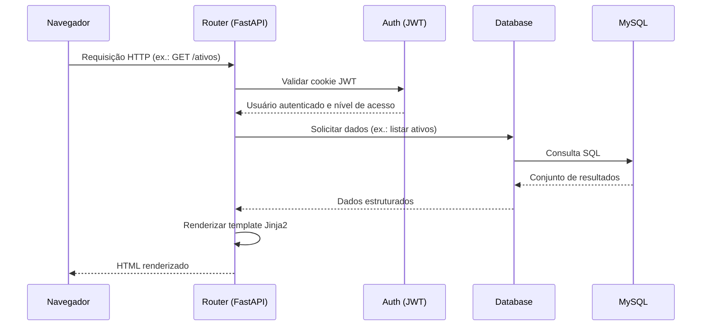
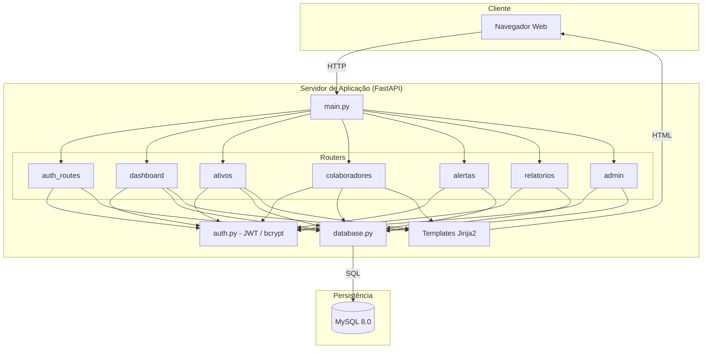

# 2. Documento de Arquitetura

Sistema **Stock Flow** — Sistema de Gestão de Ativos de TI

Este documento descreve a arquitetura de software adotada no sistema Stock Flow, suas camadas, o fluxo de uma requisição e as tecnologias empregadas.

---

## 2.1. Visão geral da arquitetura

O Stock Flow é uma aplicação web monolítica baseada em renderização server-side. O servidor de aplicação, construído com o framework FastAPI, recebe as requisições HTTP, processa a lógica de negócio, consulta o banco de dados MySQL e devolve páginas HTML renderizadas por meio de templates Jinja2.

```
┌──────────────────────────────────────────────────────────────┐
│                         NAVEGADOR                              │
│            (HTML + Tailwind CSS + JavaScript)                  │
└───────────────────────────┬────────────────────────────────┘
                            │ HTTP (requisição/resposta)
                            ▼
┌──────────────────────────────────────────────────────────────┐
│                    SERVIDOR DE APLICAÇÃO                       │
│                          (FastAPI)                             │
│  ┌──────────────────────────────────────────────────────┐   │
│  │  Camada de Apresentação  (templates Jinja2)            │   │
│  ├──────────────────────────────────────────────────────┤   │
│  │  Camada de Negócio  (routers + auth)                   │   │
│  ├──────────────────────────────────────────────────────┤   │
│  │  Camada de Dados  (database.py)                        │   │
│  └──────────────────────────────────────────────────────┘   │
└───────────────────────────┬────────────────────────────────┘
                            │ Conexão MySQL (mysql-connector)
                            ▼
┌──────────────────────────────────────────────────────────────┐
│                     BANCO DE DADOS                             │
│                       (MySQL 8.0)                              │
└──────────────────────────────────────────────────────────────┘
```

---

## 2.2. Padrão arquitetural

O sistema adota um padrão **MVC adaptado** (Model-View-Controller), organizado da seguinte forma:

- **Model (Modelo):** representado pela camada de dados (`app/database.py`) e pelo esquema do banco MySQL.
- **View (Visão):** representada pelos templates Jinja2 (`app/templates/`), responsáveis pela apresentação.
- **Controller (Controlador):** representado pelos *routers* do FastAPI (`app/routers/`), que recebem as requisições, aplicam as regras de negócio e definem qual visão será retornada.

---

## 2.3. Descrição das camadas

### 2.3.1. Camada de apresentação

Responsável pela interface com o usuário. É composta por:

- **Templates Jinja2** (`app/templates/`): páginas HTML renderizadas no servidor, organizadas por domínio (ativos, colaboradores, admin, alertas, relatórios).
- **Tailwind CSS:** framework de estilização utilitária, utilizado para a construção responsiva da interface.
- **JavaScript** (`app/static/js/`): scripts de apoio, com destaque para o `smart-select.js` (componente SmartSelect) e o `theme.js` (alternância entre tema claro e escuro).

### 2.3.2. Camada de negócio

Implementada pelos *routers* do FastAPI, concentra a lógica de negócio do sistema:

| Router | Responsabilidade |
|--------|------------------|
| `auth_routes.py` | Login, logout e emissão de token JWT |
| `dashboard.py` | Indicadores e gráficos do painel principal |
| `ativos.py` | Cadastro, edição, vinculação e manutenção de ativos |
| `colaboradores.py` | Cadastro e gerenciamento de colaboradores |
| `alertas.py` | Alertas de estoque baixo e garantias vencendo |
| `relatorios.py` | Geração de relatórios e exportação em PDF |
| `admin.py` | Gerenciamento de usuários do sistema |

O módulo `auth.py` provê funções de autenticação e autorização (verificação de token, hash de senha e controle de nível de acesso).

### 2.3.3. Camada de dados

Centralizada no módulo `app/database.py`, responsável por:

- Estabelecer e gerenciar a conexão com o MySQL (via `mysql-connector-python`);
- Executar as consultas SQL;
- Retornar os dados às camadas superiores.

As credenciais de conexão são carregadas a partir de variáveis de ambiente (`.env`), por meio da biblioteca `python-dotenv`.

---

## 2.4. Fluxo de uma requisição

A sequência a seguir descreve o percurso de uma requisição típica, do navegador ao banco de dados e de volta:



1. O navegador envia uma requisição HTTP a uma rota do sistema.
2. O router correspondente valida o cookie JWT por meio do módulo de autenticação.
3. Confirmada a autenticação e o nível de acesso, o router solicita os dados à camada de dados.
4. A camada de dados executa a consulta no MySQL e retorna os resultados.
5. O router renderiza o template Jinja2 com os dados obtidos.
6. O HTML resultante é devolvido ao navegador.

---

## 2.5. Estrutura de diretórios

```
TCC/
├── app/
│   ├── __init__.py
│   ├── main.py                 # Ponto de entrada da aplicação FastAPI
│   ├── database.py             # Conexão e consultas MySQL
│   ├── auth.py                 # Autenticação e autorização (JWT, bcrypt)
│   ├── templates_config.py     # Configuração do mecanismo de templates
│   ├── routers/                # Camada de negócio (controladores)
│   │   ├── auth_routes.py
│   │   ├── dashboard.py
│   │   ├── ativos.py
│   │   ├── colaboradores.py
│   │   ├── alertas.py
│   │   ├── relatorios.py
│   │   └── admin.py
│   ├── templates/              # Camada de apresentação (Jinja2)
│   │   ├── base.html
│   │   ├── login.html
│   │   ├── dashboard.html
│   │   ├── ativos/
│   │   ├── colaboradores/
│   │   ├── admin/
│   │   ├── alertas/
│   │   ├── relatorios/
│   │   └── errors/
│   └── static/                 # Arquivos estáticos
│       ├── css/custom.css
│       └── js/ (smart-select.js, theme.js)
├── init_db.sql                 # Esquema do banco + dados iniciais
├── requirements.txt            # Dependências Python
├── Procfile                    # Comando de inicialização (deploy)
├── railway.json                # Configuração de deploy no Railway
├── .env.example                # Modelo de variáveis de ambiente
└── docs/                       # Documentação técnica
```

---

## 2.6. Tecnologias e bibliotecas

| Tecnologia / Biblioteca | Versão | Justificativa de escolha |
|-------------------------|--------|--------------------------|
| Python | 3.12 | Linguagem de alto nível, ampla adoção e produtividade. |
| FastAPI | 0.111.0 | Framework web moderno, performático e com documentação automática da API. |
| Uvicorn | 0.29.0 | Servidor ASGI de alto desempenho para execução do FastAPI. |
| Jinja2 | 3.1.4 | Mecanismo de templates maduro, integrado ao FastAPI, para renderização server-side. |
| python-multipart | 0.0.9 | Tratamento de formulários e envio de dados via HTML. |
| mysql-connector-python | 8.4.0 | Driver oficial de conexão com o MySQL. |
| python-jose[cryptography] | 3.3.0 | Geração e validação de tokens JWT. |
| passlib[bcrypt] | 1.7.4 | Hash seguro de senhas com o algoritmo bcrypt. |
| bcrypt | 4.0.1 | Implementação do algoritmo de hashing bcrypt. |
| python-dotenv | 1.0.1 | Carregamento de variáveis de ambiente a partir do arquivo `.env`. |
| reportlab | 4.1.0 | Geração de relatórios em formato PDF. |
| Tailwind CSS | (via CDN) | Estilização utilitária e responsiva da interface. |
| MySQL | 8.0 | Sistema de gerenciamento de banco de dados relacional robusto e confiável. |

---

## 2.7. Diagrama de componentes


