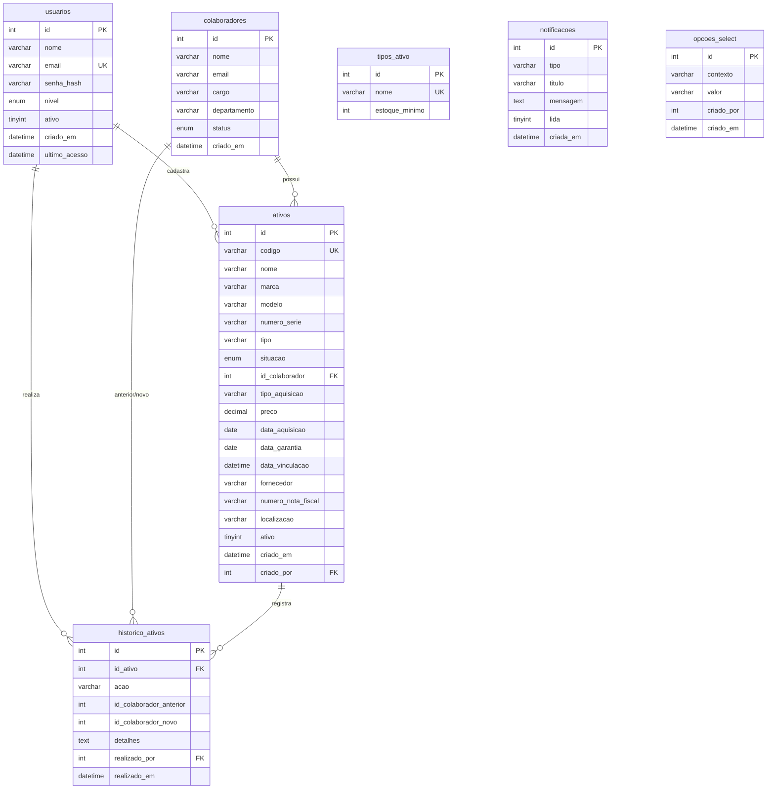

# 3. Documento de Banco de Dados

Sistema **Stock Flow** — Sistema de Gestão de Ativos de TI

Este documento descreve a modelagem do banco de dados relacional do sistema Stock Flow, implementado em MySQL 8.0. O banco é composto por sete tabelas.

---

## 3.1. Diagrama Entidade-Relacionamento (ER)

---

## 3.2. Descrição das tabelas

### 3.2.1. `usuarios`

Armazena os usuários do sistema, responsáveis pelo acesso e operação.

| Campo | Tipo | Restrições | Descrição |
|-------|------|------------|-----------|
| id | INT | PK, AUTO_INCREMENT | Identificador único do usuário. |
| nome | VARCHAR(100) | NOT NULL | Nome do usuário. |
| email | VARCHAR(100) | UNIQUE, NOT NULL | E-mail utilizado no login. |
| senha_hash | VARCHAR(255) | NOT NULL | Hash bcrypt da senha. |
| nivel | ENUM('admin','operador') | NOT NULL, DEFAULT 'operador' | Nível de acesso do usuário. |
| ativo | TINYINT(1) | NOT NULL, DEFAULT 1 | Indica se o usuário está ativo. |
| criado_em | DATETIME | NOT NULL, DEFAULT NOW() | Data de criação do registro. |
| ultimo_acesso | DATETIME | — | Data e hora do último acesso. |

### 3.2.2. `colaboradores`

Armazena os funcionários da empresa, aos quais os ativos podem ser vinculados.

| Campo | Tipo | Restrições | Descrição |
|-------|------|------------|-----------|
| id | INT | PK, AUTO_INCREMENT | Identificador único do colaborador. |
| nome | VARCHAR(100) | NOT NULL | Nome do colaborador. |
| email | VARCHAR(100) | — | E-mail do colaborador. |
| cargo | VARCHAR(100) | — | Cargo ocupado. |
| departamento | VARCHAR(100) | — | Departamento de lotação. |
| status | ENUM('ativo','desligado') | NOT NULL, DEFAULT 'ativo' | Situação do colaborador. |
| criado_em | DATETIME | NOT NULL, DEFAULT NOW() | Data de criação do registro. |

### 3.2.3. `tipos_ativo`

Define os tipos de ativo e o estoque mínimo configurável de cada um.

| Campo | Tipo | Restrições | Descrição |
|-------|------|------------|-----------|
| id | INT | PK, AUTO_INCREMENT | Identificador único do tipo. |
| nome | VARCHAR(100) | UNIQUE, NOT NULL | Nome do tipo de ativo. |
| estoque_minimo | INT | NOT NULL, DEFAULT 0 | Quantidade mínima em estoque antes de gerar alerta. |

### 3.2.4. `ativos`

Tabela central do sistema, armazena os ativos de TI.

| Campo | Tipo | Restrições | Descrição |
|-------|------|------------|-----------|
| id | INT | PK, AUTO_INCREMENT | Identificador único do ativo. |
| codigo | VARCHAR(20) | UNIQUE, NOT NULL | Código gerado automaticamente (AST-001, ...). |
| nome | VARCHAR(100) | NOT NULL | Nome/descrição do ativo. |
| marca | VARCHAR(100) | — | Marca do ativo. |
| modelo | VARCHAR(100) | — | Modelo do ativo. |
| numero_serie | VARCHAR(100) | — | Número de série. |
| tipo | VARCHAR(100) | — | Tipo do ativo. |
| situacao | ENUM('Em estoque','Em uso','Manutenção','Desativado') | NOT NULL, DEFAULT 'Em estoque' | Situação atual do ativo. |
| id_colaborador | INT | FK → colaboradores(id), ON DELETE SET NULL | Colaborador vinculado. |
| tipo_aquisicao | VARCHAR(50) | — | Forma de aquisição (compra, comodato, ...). |
| preco | DECIMAL(10,2) | — | Valor do ativo. |
| data_aquisicao | DATE | — | Data de aquisição. |
| data_garantia | DATE | — | Data de término da garantia. |
| data_vinculacao | DATETIME | — | Data da vinculação ao colaborador. |
| fornecedor | VARCHAR(100) | — | Fornecedor do ativo. |
| numero_nota_fiscal | VARCHAR(50) | — | Número da nota fiscal. |
| localizacao | VARCHAR(100) | — | Localização física do ativo. |
| ativo | TINYINT(1) | NOT NULL, DEFAULT 1 | Indica se o registro está ativo. |
| criado_em | DATETIME | NOT NULL, DEFAULT NOW() | Data de criação do registro. |
| criado_por | INT | FK → usuarios(id), ON DELETE SET NULL | Usuário que cadastrou o ativo. |

### 3.2.5. `historico_ativos`

Registra todas as movimentações sofridas por um ativo.

| Campo | Tipo | Restrições | Descrição |
|-------|------|------------|-----------|
| id | INT | PK, AUTO_INCREMENT | Identificador único do registro. |
| id_ativo | INT | NOT NULL, FK → ativos(id), ON DELETE CASCADE | Ativo movimentado. |
| acao | VARCHAR(50) | NOT NULL | Tipo de ação (Cadastro, Vinculação, Manutenção, ...). |
| id_colaborador_anterior | INT | — | Colaborador anterior (em desvinculações). |
| id_colaborador_novo | INT | — | Novo colaborador (em vinculações). |
| detalhes | TEXT | — | Descrição detalhada da movimentação. |
| realizado_por | INT | FK → usuarios(id), ON DELETE SET NULL | Usuário responsável pela ação. |
| realizado_em | DATETIME | NOT NULL, DEFAULT NOW() | Data e hora da movimentação. |

### 3.2.6. `notificacoes`

Armazena notificações e alertas gerados pelo sistema.

| Campo | Tipo | Restrições | Descrição |
|-------|------|------------|-----------|
| id | INT | PK, AUTO_INCREMENT | Identificador único da notificação. |
| tipo | VARCHAR(50) | NOT NULL | Tipo da notificação (ex.: estoque_baixo). |
| titulo | VARCHAR(200) | NOT NULL | Título da notificação. |
| mensagem | TEXT | NOT NULL | Conteúdo da mensagem. |
| lida | TINYINT(1) | NOT NULL, DEFAULT 0 | Indica se a notificação foi lida. |
| criada_em | DATETIME | NOT NULL, DEFAULT NOW() | Data de criação. |

### 3.2.7. `opcoes_select`

Suporta o componente SmartSelect, armazenando as opções dinâmicas dos campos de seleção.

| Campo | Tipo | Restrições | Descrição |
|-------|------|------------|-----------|
| id | INT | PK, AUTO_INCREMENT | Identificador único da opção. |
| contexto | VARCHAR(100) | NOT NULL, UNIQUE(contexto, valor) | Campo ao qual a opção pertence (tipo_ativo, cargo, ...). |
| valor | VARCHAR(100) | NOT NULL, UNIQUE(contexto, valor) | Valor da opção. |
| criado_por | INT | — | Usuário que adicionou a opção. |
| criado_em | DATETIME | NOT NULL, DEFAULT NOW() | Data de criação. |

---

## 3.3. Relacionamentos entre tabelas

- **usuarios → ativos** (1:N): um usuário pode cadastrar diversos ativos (`ativos.criado_por`). Ao excluir o usuário, o campo é definido como nulo (`ON DELETE SET NULL`).
- **usuarios → historico_ativos** (1:N): um usuário pode realizar diversas movimentações (`historico_ativos.realizado_por`).
- **colaboradores → ativos** (1:N): um colaborador pode possuir vários ativos vinculados (`ativos.id_colaborador`). Ao excluir o colaborador, o vínculo é anulado (`ON DELETE SET NULL`).
- **ativos → historico_ativos** (1:N): cada ativo possui diversos registros de histórico. A exclusão do ativo remove em cascata seus registros de histórico (`ON DELETE CASCADE`).
- **colaboradores → historico_ativos**: os campos `id_colaborador_anterior` e `id_colaborador_novo` referenciam logicamente colaboradores envolvidos nas movimentações.

---

## 3.4. Dicionário de dados consolidado

| Tabela | Campo | Tipo | Tamanho | Obrigatório | Descrição |
|--------|-------|------|---------|-------------|-----------|
| usuarios | id | INT | — | Sim | Chave primária |
| usuarios | nome | VARCHAR | 100 | Sim | Nome do usuário |
| usuarios | email | VARCHAR | 100 | Sim | E-mail (único) |
| usuarios | senha_hash | VARCHAR | 255 | Sim | Hash bcrypt |
| usuarios | nivel | ENUM | — | Sim | admin / operador |
| usuarios | ativo | TINYINT | 1 | Sim | Status do usuário |
| usuarios | criado_em | DATETIME | — | Sim | Data de criação |
| usuarios | ultimo_acesso | DATETIME | — | Não | Último acesso |
| colaboradores | id | INT | — | Sim | Chave primária |
| colaboradores | nome | VARCHAR | 100 | Sim | Nome |
| colaboradores | email | VARCHAR | 100 | Não | E-mail |
| colaboradores | cargo | VARCHAR | 100 | Não | Cargo |
| colaboradores | departamento | VARCHAR | 100 | Não | Departamento |
| colaboradores | status | ENUM | — | Sim | ativo / desligado |
| colaboradores | criado_em | DATETIME | — | Sim | Data de criação |
| tipos_ativo | id | INT | — | Sim | Chave primária |
| tipos_ativo | nome | VARCHAR | 100 | Sim | Nome do tipo (único) |
| tipos_ativo | estoque_minimo | INT | — | Sim | Estoque mínimo |
| ativos | id | INT | — | Sim | Chave primária |
| ativos | codigo | VARCHAR | 20 | Sim | Código único |
| ativos | nome | VARCHAR | 100 | Sim | Nome do ativo |
| ativos | marca | VARCHAR | 100 | Não | Marca |
| ativos | modelo | VARCHAR | 100 | Não | Modelo |
| ativos | numero_serie | VARCHAR | 100 | Não | Número de série |
| ativos | tipo | VARCHAR | 100 | Não | Tipo |
| ativos | situacao | ENUM | — | Sim | Situação do ativo |
| ativos | id_colaborador | INT | — | Não | FK colaborador |
| ativos | tipo_aquisicao | VARCHAR | 50 | Não | Forma de aquisição |
| ativos | preco | DECIMAL | 10,2 | Não | Valor |
| ativos | data_aquisicao | DATE | — | Não | Data de aquisição |
| ativos | data_garantia | DATE | — | Não | Fim da garantia |
| ativos | data_vinculacao | DATETIME | — | Não | Data de vinculação |
| ativos | fornecedor | VARCHAR | 100 | Não | Fornecedor |
| ativos | numero_nota_fiscal | VARCHAR | 50 | Não | Nota fiscal |
| ativos | localizacao | VARCHAR | 100 | Não | Localização |
| ativos | ativo | TINYINT | 1 | Sim | Status do registro |
| ativos | criado_em | DATETIME | — | Sim | Data de criação |
| ativos | criado_por | INT | — | Não | FK usuário |
| historico_ativos | id | INT | — | Sim | Chave primária |
| historico_ativos | id_ativo | INT | — | Sim | FK ativo |
| historico_ativos | acao | VARCHAR | 50 | Sim | Ação realizada |
| historico_ativos | id_colaborador_anterior | INT | — | Não | Colaborador anterior |
| historico_ativos | id_colaborador_novo | INT | — | Não | Novo colaborador |
| historico_ativos | detalhes | TEXT | — | Não | Detalhes |
| historico_ativos | realizado_por | INT | — | Não | FK usuário |
| historico_ativos | realizado_em | DATETIME | — | Sim | Data da ação |
| notificacoes | id | INT | — | Sim | Chave primária |
| notificacoes | tipo | VARCHAR | 50 | Sim | Tipo |
| notificacoes | titulo | VARCHAR | 200 | Sim | Título |
| notificacoes | mensagem | TEXT | — | Sim | Mensagem |
| notificacoes | lida | TINYINT | 1 | Sim | Lida ou não |
| notificacoes | criada_em | DATETIME | — | Sim | Data de criação |
| opcoes_select | id | INT | — | Sim | Chave primária |
| opcoes_select | contexto | VARCHAR | 100 | Sim | Contexto do campo |
| opcoes_select | valor | VARCHAR | 100 | Sim | Valor da opção |
| opcoes_select | criado_por | INT | — | Não | Usuário criador |
| opcoes_select | criado_em | DATETIME | — | Sim | Data de criação |

---

## 3.5. Decisões de modelagem

- **Geração automática de código:** o campo `ativos.codigo` é definido como único e gerado pela aplicação no padrão `AST-NNN`, garantindo identificação inequívoca e legível dos ativos.
- **Exclusão lógica de ativos:** em vez de remover fisicamente os registros, utiliza-se o campo `ativo` (TINYINT) para desativação, preservando o histórico e a integridade referencial.
- **Histórico em cascata:** a chave estrangeira `historico_ativos.id_ativo` utiliza `ON DELETE CASCADE`, de modo que, caso um ativo seja efetivamente removido, seu histórico seja eliminado junto, evitando registros órfãos.
- **Anulação de vínculos:** as chaves estrangeiras `id_colaborador` e `criado_por` adotam `ON DELETE SET NULL`, preservando os ativos mesmo após a exclusão de colaboradores ou usuários.
- **Opções dinâmicas (SmartSelect):** a tabela `opcoes_select` centraliza as opções dos campos de seleção, com restrição de unicidade no par `(contexto, valor)`, permitindo a adição e remoção de opções sem alteração de esquema.
- **Senhas protegidas:** o campo `senha_hash` armazena exclusivamente o hash bcrypt, nunca a senha em texto puro.
