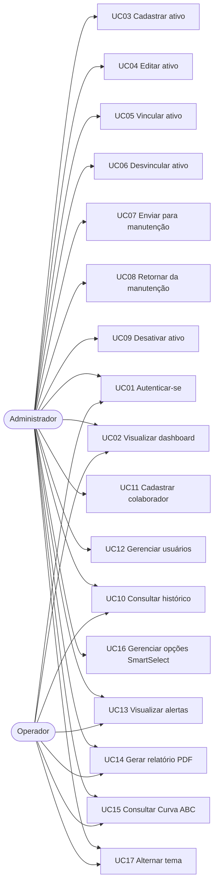

# 4. Documento de Casos de Uso

Sistema **Stock Flow** — Sistema de Gestão de Ativos de TI

Este documento apresenta os atores do sistema e os casos de uso que descrevem as interações entre os usuários e o Stock Flow.

---

## 4.1. Atores

| Ator | Descrição |
|------|-----------|
| **Administrador** | Usuário com acesso total ao sistema. Pode cadastrar, editar e desativar ativos e colaboradores, gerenciar usuários e configurar parâmetros. |
| **Operador** | Usuário com acesso restrito. Pode visualizar ativos, colaboradores, dashboard e relatórios, mas não realiza alterações cadastrais. |

---

## 4.2. Diagrama de casos de uso

---

## 4.3. Especificação dos casos de uso

### UC01 — Autenticar-se no sistema
- **Ator:** Administrador, Operador
- **Pré-condição:** O usuário possui credenciais válidas e cadastradas.
- **Fluxo principal:**
  1. O usuário acessa a tela de login.
  2. Informa e-mail e senha.
  3. O sistema valida as credenciais e verifica o hash da senha.
  4. O sistema emite um token JWT e o armazena em cookie HTTP-only.
  5. O usuário é redirecionado ao dashboard.
- **Fluxo alternativo:** Caso as credenciais sejam inválidas, o sistema exibe mensagem de erro e permanece na tela de login.
- **Pós-condição:** O usuário fica autenticado com sessão ativa.

### UC02 — Visualizar dashboard
- **Ator:** Administrador, Operador
- **Pré-condição:** Usuário autenticado.
- **Fluxo principal:**
  1. O usuário acessa o dashboard.
  2. O sistema apresenta indicadores em tempo real e gráficos.
- **Fluxo alternativo:** Caso não haja dados, o sistema exibe indicadores zerados.
- **Pós-condição:** Os indicadores são exibidos ao usuário.

### UC03 — Cadastrar ativo
- **Ator:** Administrador
- **Pré-condição:** Administrador autenticado.
- **Fluxo principal:**
  1. O administrador acessa o formulário de cadastro de ativo.
  2. Preenche os dados do ativo.
  3. O sistema gera automaticamente o código (AST-NNN).
  4. O sistema salva o ativo e registra o evento de cadastro no histórico.
- **Fluxo alternativo:** Caso haja campos obrigatórios não preenchidos, o sistema sinaliza os erros de validação.
- **Pós-condição:** O ativo é cadastrado com situação "Em estoque".

### UC04 — Editar ativo
- **Ator:** Administrador
- **Pré-condição:** O ativo existe e o administrador está autenticado.
- **Fluxo principal:**
  1. O administrador seleciona um ativo e abre o formulário de edição.
  2. Altera os dados desejados (exceto o código).
  3. O sistema salva as alterações.
- **Fluxo alternativo:** Em caso de dados inválidos, o sistema apresenta os erros.
- **Pós-condição:** Os dados do ativo são atualizados.

### UC05 — Vincular ativo a colaborador
- **Ator:** Administrador
- **Pré-condição:** O ativo está disponível (não está em manutenção nem desativado).
- **Fluxo principal:**
  1. O administrador seleciona um ativo e a opção de vinculação.
  2. Escolhe o colaborador.
  3. O sistema altera a situação para "Em uso", registra a data de vinculação e grava o evento no histórico.
- **Fluxo alternativo:** Caso o ativo esteja em manutenção, o sistema impede a vinculação.
- **Pós-condição:** O ativo passa a estar vinculado ao colaborador.

### UC06 — Desvincular ativo
- **Ator:** Administrador
- **Pré-condição:** O ativo está vinculado a um colaborador.
- **Fluxo principal:**
  1. O administrador seleciona o ativo vinculado e a opção de desvinculação.
  2. O sistema remove o vínculo, altera a situação para "Em estoque" e registra o evento no histórico.
- **Fluxo alternativo:** —
- **Pós-condição:** O ativo retorna ao estoque, sem colaborador associado.

### UC07 — Enviar ativo para manutenção
- **Ator:** Administrador
- **Pré-condição:** O ativo não está desativado.
- **Fluxo principal:**
  1. O administrador seleciona o ativo e a opção de manutenção.
  2. Informa os detalhes (ex.: motivo).
  3. O sistema altera a situação para "Manutenção" e registra no histórico.
- **Fluxo alternativo:** —
- **Pós-condição:** O ativo fica com situação "Manutenção".

### UC08 — Retornar ativo da manutenção
- **Ator:** Administrador
- **Pré-condição:** O ativo está em manutenção.
- **Fluxo principal:**
  1. O administrador seleciona o ativo em manutenção.
  2. Confirma o retorno.
  3. O sistema altera a situação para "Em estoque" e registra no histórico.
- **Fluxo alternativo:** —
- **Pós-condição:** O ativo retorna ao estoque.

### UC09 — Desativar ativo
- **Ator:** Administrador
- **Pré-condição:** O ativo existe.
- **Fluxo principal:**
  1. O administrador seleciona o ativo e a opção de desativação.
  2. O sistema altera a situação para "Desativado" e o remove do inventário ativo.
- **Fluxo alternativo:** —
- **Pós-condição:** O ativo deixa de constar no inventário ativo.

### UC10 — Consultar histórico de um ativo
- **Ator:** Administrador, Operador
- **Pré-condição:** O ativo existe.
- **Fluxo principal:**
  1. O usuário acessa o detalhamento do ativo.
  2. O sistema exibe todas as movimentações registradas em ordem cronológica.
- **Fluxo alternativo:** —
- **Pós-condição:** O histórico é exibido ao usuário.

### UC11 — Cadastrar colaborador
- **Ator:** Administrador
- **Pré-condição:** Administrador autenticado.
- **Fluxo principal:**
  1. O administrador acessa o formulário de colaborador.
  2. Preenche os dados.
  3. O sistema salva o colaborador.
- **Fluxo alternativo:** Em caso de dados inválidos, o sistema apresenta os erros.
- **Pós-condição:** O colaborador é cadastrado com status "ativo".

### UC12 — Gerenciar usuários do sistema
- **Ator:** Administrador
- **Pré-condição:** Administrador autenticado.
- **Fluxo principal:**
  1. O administrador acessa a área de usuários.
  2. Cadastra, edita ou desativa usuários, definindo o nível de acesso.
  3. O sistema persiste as alterações.
- **Fluxo alternativo:** Operadores não têm acesso a esta funcionalidade (erro 403).
- **Pós-condição:** Os usuários são gerenciados conforme a ação realizada.

### UC13 — Visualizar alertas
- **Ator:** Administrador, Operador
- **Pré-condição:** Usuário autenticado.
- **Fluxo principal:**
  1. O usuário acessa a área de alertas.
  2. O sistema exibe alertas de estoque baixo e de garantias vencendo nos próximos 30 dias.
- **Fluxo alternativo:** Caso não haja alertas, o sistema exibe mensagem informativa.
- **Pós-condição:** Os alertas são apresentados.

### UC14 — Gerar relatório em PDF
- **Ator:** Administrador, Operador
- **Pré-condição:** Usuário autenticado.
- **Fluxo principal:**
  1. O usuário acessa a área de relatórios.
  2. Solicita a exportação em PDF.
  3. O sistema gera o documento e o disponibiliza para download.
- **Fluxo alternativo:** —
- **Pós-condição:** O relatório em PDF é gerado.

### UC15 — Consultar Curva ABC
- **Ator:** Administrador, Operador
- **Pré-condição:** Existem ativos cadastrados com valor.
- **Fluxo principal:**
  1. O usuário acessa a análise de inventário.
  2. O sistema calcula e classifica os itens nas categorias A, B e C.
- **Fluxo alternativo:** —
- **Pós-condição:** A Curva ABC é exibida.

### UC16 — Gerenciar opções do SmartSelect
- **Ator:** Administrador
- **Pré-condição:** Administrador autenticado.
- **Fluxo principal:**
  1. Durante o preenchimento de um campo de seleção, o administrador adiciona ou remove uma opção inline.
  2. O sistema persiste a alteração na tabela de opções.
- **Fluxo alternativo:** Opções duplicadas são ignoradas pela restrição de unicidade.
- **Pós-condição:** As opções do campo são atualizadas.

### UC17 — Alternar tema (claro/escuro)
- **Ator:** Administrador, Operador
- **Pré-condição:** Usuário autenticado.
- **Fluxo principal:**
  1. O usuário aciona o seletor de tema.
  2. O sistema alterna entre o modo claro e o escuro e salva a preferência no navegador.
- **Fluxo alternativo:** —
- **Pós-condição:** O tema selecionado é aplicado e persistido localmente.
